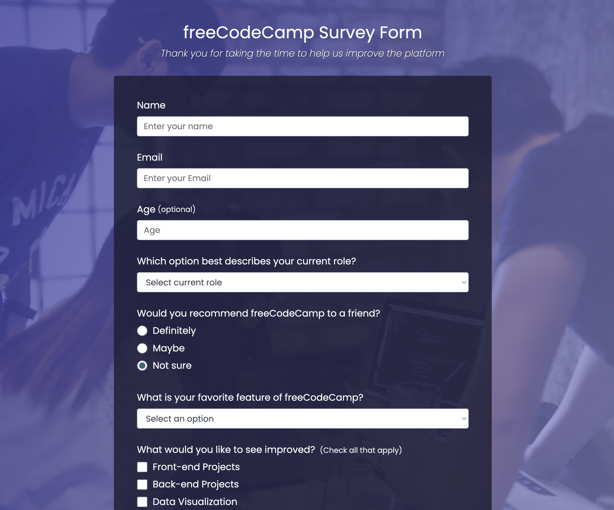
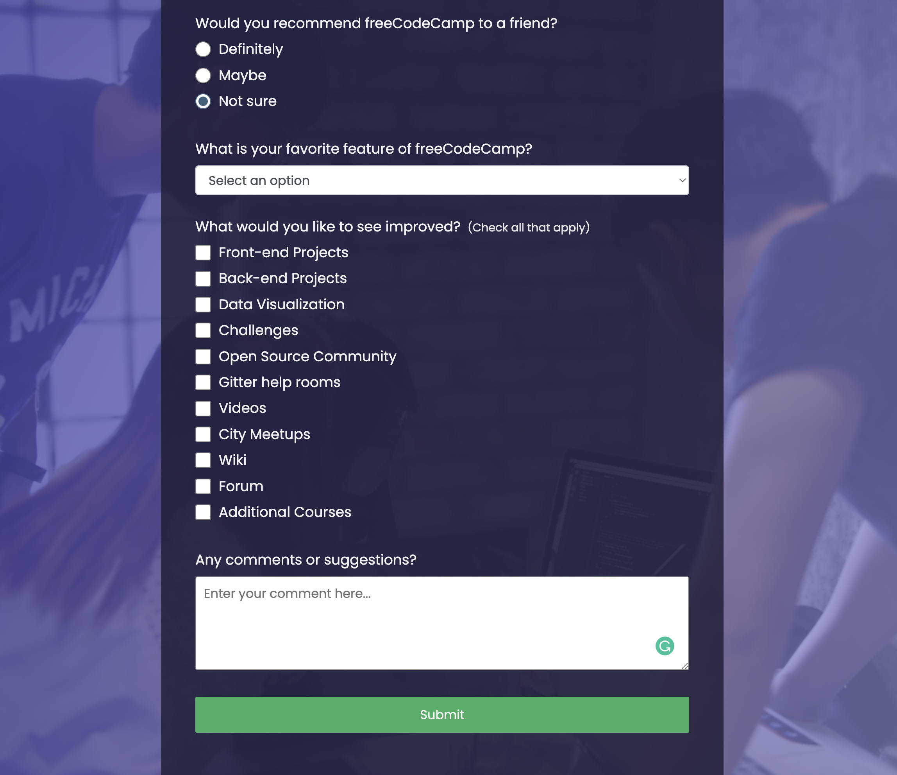

# freeCodeCamp-Survey-Form

## Description
This is one of the certification project for [Responsive Web Design](https://www.freecodecamp.org/learn/2022/responsive-web-design/) from the freeCodeCamp. For this project, a survey form will be built to collect data from the users.

In this project, HTML and CSS was used to create the webpage. The Mock webpage can be found [here](https://survey-form.freecodecamp.rocks).

## Screenshot
Here are the screenshots of the deployed webpage

## Deployment
Click the link to test my webpage: https://xiaozhao1111.github.io/freeCodeCamp-Survey-Form/

## Contribution
Xiao Zhao, zhaoxiao20071106@gmail.com

## Community
It's open-source. Feel free to use it for learning purpose.